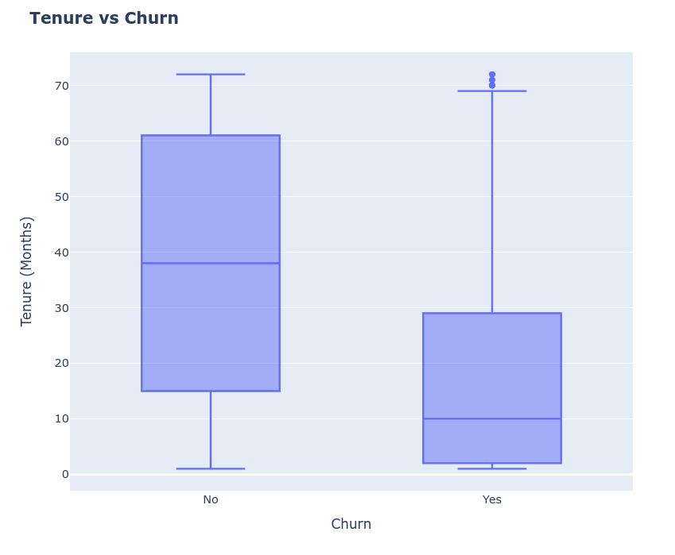
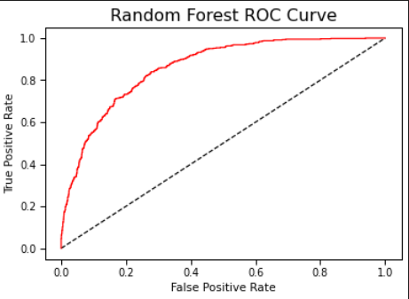
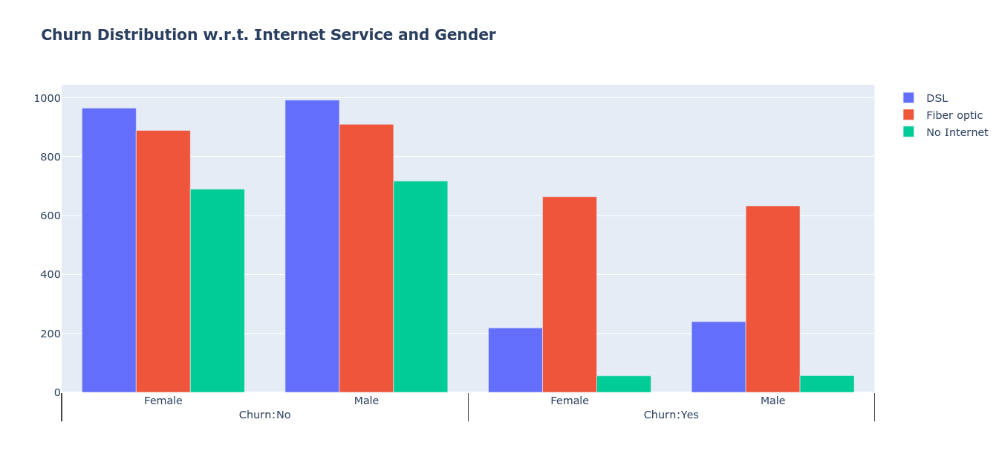
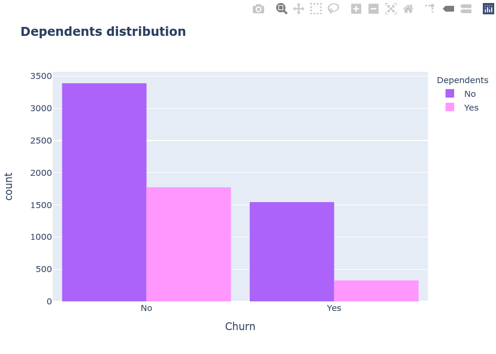
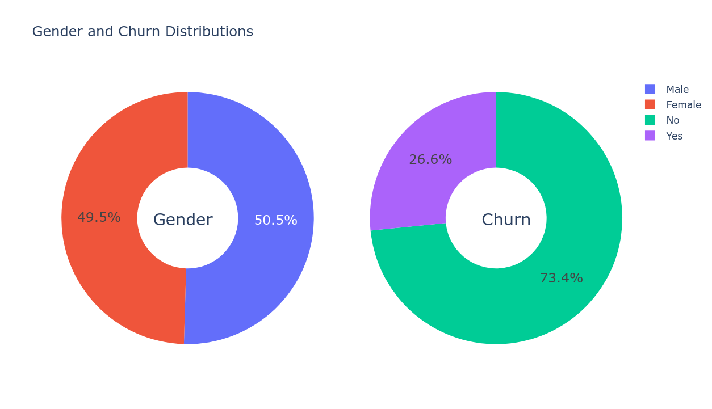
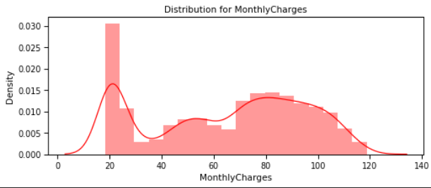

# 📞 Predict Telecom Churn: Keep Customers Happy! ✨

**Want to know which customers are about to leave?** This project uses machine learning to predict churn, helping telecom companies boost retention and save costs.

**Explore the analysis:**

🔗 **Click [here](https://github.com/TaqiRaza512/Churn-Prediction/blob/main/customer-churn-prediction.ipynb) to view the full Jupyter Notebook.**

---

## 🚀 Quick Insights

* **Key Drivers:** Month-to-month contracts, electronic checks, and fiber optic service are strong indicators of churn.
* **Best Models:** Gradient Boosting and Voting Classifiers achieved ~81% accuracy.
* **Actionable Tips:** Focus on contract strategy, payment optimization, and service improvement.

## 📊 Key Findings

* **Churn Rate:** ~26.6% customers left.
* **High Risk:** Month-to-month contracts, electronic checks, and fiber optic service.
* **Impact:** Customer demographics and service usage also play a significant role.

## 🛠️ Tech Stack

* Python, Pandas, NumPy
* Matplotlib, Seaborn, Plotly
* Scikit-learn
  
## Results

## 🤝 Let's Connect!

Questions or ideas? Feel free to reach out.

**Dive into the data and discover how to keep your customers loyal!**
